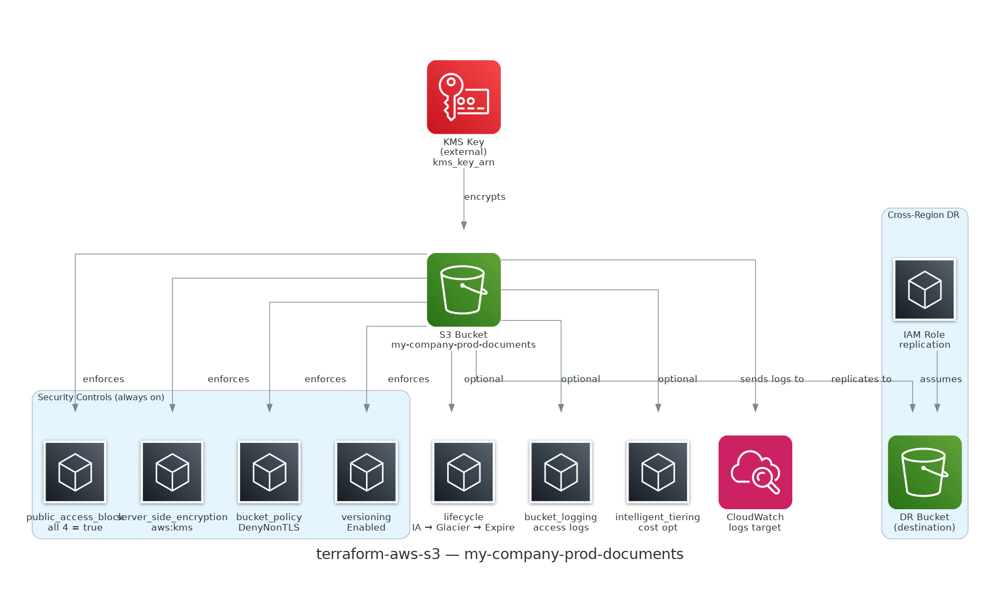

# terraform-aws-s3

Production-grade AWS S3 bucket module — SSE-KMS encryption, public access
blocked, versioning, TLS-only policy, lifecycle, access logging, CORS,
Object Lock (WORM), and cross-region replication.

Part of the [Devotica Terraform module catalog](https://registry.terraform.io/modules/devotica-labs).

[](https://github.com/devotica-labs/terraform-aws-s3/actions/workflows/ci.yml)
[](https://github.com/devotica-labs/terraform-aws-s3/actions/workflows/architecture-diagram.yml)
[](LICENSE)

## Architecture

<!-- BEGIN_ARCH -->



<sub>Generated by `.github/workflows/architecture-diagram.yml` on every push to main. Do not edit the image by hand — change the Terraform code in `examples/complete/` and the bot will regenerate it.</sub>

<!-- END_ARCH -->

## Security defaults (all on by default)

| Control | Default | Regulation |
|---|---|---|
| SSE-KMS encryption | ✅ Always on | RBI IT Framework §6.4, PCI-DSS, DPDP |
| S3 Bucket Keys | ✅ Enabled | Cost saving — 99% KMS API reduction |
| Public access blocked | ✅ All 4 settings | CIS AWS Foundations 2.1.1 |
| TLS-only bucket policy | ✅ Always enforced | CIS AWS Foundations 2.1.2 |
| Versioning | ✅ Enabled | RBI audit trail, SOC 2 CC6.1 |
| force_destroy | ❌ false | Data protection — never deletable by accident |

<!-- BEGIN_TF_DOCS -->


## Usage

### Basic

```hcl
# Basic example — minimum required inputs
# SSE-KMS encryption, public access blocked, versioning on, TLS-only policy
#
# NOTE: uses local path during development.
# Change to Registry source after v1.0.0 is published:
#   source  = "devotica-labs/s3/aws"
#   version = "~> 1.0"

terraform {
  required_version = ">= 1.6.0"
  required_providers {
    aws = {
      source  = "hashicorp/aws"
      version = "~> 6.44"
    }
  }
}

module "s3_bucket" {
  source = "../.."

  name        = "my-company-documents"
  kms_key_arn = "arn:aws:kms:ap-south-1:123456789012:key/mrk-xxxxxxxx"

  tags = {
    Environment = "sandbox"
    Project     = "my-project"
    Owner       = "platform@mycompany.com"
    CostCenter  = "PLATFORM"
    ManagedBy   = "terraform"
    Repo        = "github.com/mycompany/infra"
  }
}
```

### Complete

```hcl
# Complete example — all variables exercised
# Fintech prod-grade: KMS, versioning, lifecycle, logging, replication
#
# NOTE: uses local path during development.
# Change to Registry source after v1.0.0 is published:
#   source  = "devotica-labs/s3/aws"
#   version = "~> 1.0"

terraform {
  required_version = ">= 1.6.0"
  required_providers {
    aws = {
      source  = "hashicorp/aws"
      version = "~> 6.44"
    }
  }
}

module "s3_bucket" {
  source = "../.."

  name        = "my-company-prod-documents"
  kms_key_arn = "arn:aws:kms:ap-south-1:123456789012:key/mrk-xxxxxxxx"

  versioning_enabled             = true
  mfa_delete                     = false
  transition_to_ia_days          = 30
  transition_to_glacier_days     = 90
  noncurrent_version_expiry_days = 365
  expiry_days                    = 0

  logging_target_bucket = "my-company-prod-access-logs"
  logging_target_prefix = "s3-access-logs/documents/"

  replication_enabled                 = true
  replication_destination_bucket_arn  = "arn:aws:s3:::my-company-dr-documents"
  replication_destination_kms_key_arn = "arn:aws:kms:ap-south-2:123456789012:key/mrk-yyyyyyyy"

  object_lock_enabled = false
  object_lock_mode    = "GOVERNANCE"
  object_lock_days    = 0

  intelligent_tiering_enabled = true
  bucket_key_enabled          = true
  force_destroy               = false

  tags = {
    Environment = "production"
    Project     = "my-project"
    Owner       = "platform@mycompany.com"
    CostCenter  = "PLATFORM-PROD"
    ManagedBy   = "terraform"
    Repo        = "github.com/mycompany/infra"
  }
}
```

## Requirements

| Name | Version |
|------|---------|
| <a name="requirement_terraform"></a> [terraform](#requirement\_terraform) | >= 1.6.0, < 2.0.0 |
| <a name="requirement_aws"></a> [aws](#requirement\_aws) | ~> 6.44 |
## Providers

| Name | Version |
|------|---------|
| <a name="provider_aws"></a> [aws](#provider\_aws) | ~> 6.44 |
## Resources

| Name | Type |
|------|------|
| [aws_iam_role.replication](https://registry.terraform.io/providers/hashicorp/aws/latest/docs/resources/iam_role) | resource |
| [aws_iam_role_policy.replication](https://registry.terraform.io/providers/hashicorp/aws/latest/docs/resources/iam_role_policy) | resource |
| [aws_s3_bucket.this](https://registry.terraform.io/providers/hashicorp/aws/latest/docs/resources/s3_bucket) | resource |
| [aws_s3_bucket_cors_configuration.this](https://registry.terraform.io/providers/hashicorp/aws/latest/docs/resources/s3_bucket_cors_configuration) | resource |
| [aws_s3_bucket_intelligent_tiering_configuration.this](https://registry.terraform.io/providers/hashicorp/aws/latest/docs/resources/s3_bucket_intelligent_tiering_configuration) | resource |
| [aws_s3_bucket_lifecycle_configuration.this](https://registry.terraform.io/providers/hashicorp/aws/latest/docs/resources/s3_bucket_lifecycle_configuration) | resource |
| [aws_s3_bucket_logging.this](https://registry.terraform.io/providers/hashicorp/aws/latest/docs/resources/s3_bucket_logging) | resource |
| [aws_s3_bucket_notification.this](https://registry.terraform.io/providers/hashicorp/aws/latest/docs/resources/s3_bucket_notification) | resource |
| [aws_s3_bucket_object_lock_configuration.this](https://registry.terraform.io/providers/hashicorp/aws/latest/docs/resources/s3_bucket_object_lock_configuration) | resource |
| [aws_s3_bucket_policy.this](https://registry.terraform.io/providers/hashicorp/aws/latest/docs/resources/s3_bucket_policy) | resource |
| [aws_s3_bucket_public_access_block.this](https://registry.terraform.io/providers/hashicorp/aws/latest/docs/resources/s3_bucket_public_access_block) | resource |
| [aws_s3_bucket_replication_configuration.this](https://registry.terraform.io/providers/hashicorp/aws/latest/docs/resources/s3_bucket_replication_configuration) | resource |
| [aws_s3_bucket_server_side_encryption_configuration.this](https://registry.terraform.io/providers/hashicorp/aws/latest/docs/resources/s3_bucket_server_side_encryption_configuration) | resource |
| [aws_s3_bucket_versioning.this](https://registry.terraform.io/providers/hashicorp/aws/latest/docs/resources/s3_bucket_versioning) | resource |
## Inputs

| Name | Description | Type | Default | Required |
|------|-------------|------|---------|:--------:|
| <a name="input_kms_key_arn"></a> [kms\_key\_arn](#input\_kms\_key\_arn) | ARN of the KMS key to use for SSE-KMS encryption. Required — no plaintext S3 in fintech. | `string` | n/a | yes |
| <a name="input_name"></a> [name](#input\_name) | Logical name for the bucket. Used as bucket name and resource prefix. | `string` | n/a | yes |
| <a name="input_bucket_key_enabled"></a> [bucket\_key\_enabled](#input\_bucket\_key\_enabled) | Enable S3 Bucket Keys to reduce KMS API calls and costs by up to 99%. | `bool` | `true` | no |
| <a name="input_cors_rules"></a> [cors\_rules](#input\_cors\_rules) | List of CORS rules. Leave empty to disable CORS. | <pre>list(object({<br/>    allowed_headers = optional(list(string), ["*"])<br/>    allowed_methods = list(string)<br/>    allowed_origins = list(string)<br/>    expose_headers  = optional(list(string), [])<br/>    max_age_seconds = optional(number, 3600)<br/>  }))</pre> | `[]` | no |
| <a name="input_expiry_days"></a> [expiry\_days](#input\_expiry\_days) | Days before current objects are permanently deleted. 0 disables expiry (recommended for audit logs). | `number` | `0` | no |
| <a name="input_force_destroy"></a> [force\_destroy](#input\_force\_destroy) | Allow bucket deletion even when it contains objects. NEVER true in prod. Safe for sandbox/test. | `bool` | `false` | no |
| <a name="input_intelligent_tiering_enabled"></a> [intelligent\_tiering\_enabled](#input\_intelligent\_tiering\_enabled) | Enable S3 Intelligent-Tiering for automatic cost optimisation. | `bool` | `false` | no |
| <a name="input_logging_target_bucket"></a> [logging\_target\_bucket](#input\_logging\_target\_bucket) | Bucket name to receive server access logs. Leave empty to disable access logging. | `string` | `""` | no |
| <a name="input_logging_target_prefix"></a> [logging\_target\_prefix](#input\_logging\_target\_prefix) | Prefix for access log objects in the target bucket. | `string` | `"s3-access-logs/"` | no |
| <a name="input_mfa_delete"></a> [mfa\_delete](#input\_mfa\_delete) | Require MFA to permanently delete object versions. Enable in prod for highest-sensitivity buckets. | `bool` | `false` | no |
| <a name="input_noncurrent_version_expiry_days"></a> [noncurrent\_version\_expiry\_days](#input\_noncurrent\_version\_expiry\_days) | Days before noncurrent object versions are permanently deleted. 0 disables expiry. | `number` | `90` | no |
| <a name="input_notification_queue_arn"></a> [notification\_queue\_arn](#input\_notification\_queue\_arn) | ARN of the SQS queue to receive S3 event notifications. Leave empty to disable. Satisfies CKV2\_AWS\_62. | `string` | `""` | no |
| <a name="input_object_lock_days"></a> [object\_lock\_days](#input\_object\_lock\_days) | Number of days for Object Lock default retention. 0 means no default retention period. | `number` | `0` | no |
| <a name="input_object_lock_enabled"></a> [object\_lock\_enabled](#input\_object\_lock\_enabled) | Enable S3 Object Lock (WORM). Cannot be disabled after bucket creation. Required for some RBI/SEBI audit mandates. | `bool` | `false` | no |
| <a name="input_object_lock_mode"></a> [object\_lock\_mode](#input\_object\_lock\_mode) | Object Lock retention mode: GOVERNANCE (admin can override) or COMPLIANCE (no override, ever). | `string` | `"GOVERNANCE"` | no |
| <a name="input_replication_destination_bucket_arn"></a> [replication\_destination\_bucket\_arn](#input\_replication\_destination\_bucket\_arn) | ARN of the destination bucket for cross-region replication. | `string` | `""` | no |
| <a name="input_replication_destination_kms_key_arn"></a> [replication\_destination\_kms\_key\_arn](#input\_replication\_destination\_kms\_key\_arn) | ARN of the KMS key in the destination region for encrypted replication. | `string` | `""` | no |
| <a name="input_replication_enabled"></a> [replication\_enabled](#input\_replication\_enabled) | Enable cross-region replication to a DR bucket. Required for RBI data durability mandates in prod. | `bool` | `false` | no |
| <a name="input_tags"></a> [tags](#input\_tags) | Map of tags applied to all resources. Merged with mandatory Devotica tags. | `map(string)` | `{}` | no |
| <a name="input_transition_to_glacier_days"></a> [transition\_to\_glacier\_days](#input\_transition\_to\_glacier\_days) | Days before current objects transition to S3 Glacier Instant Retrieval. 0 disables transition. | `number` | `90` | no |
| <a name="input_transition_to_ia_days"></a> [transition\_to\_ia\_days](#input\_transition\_to\_ia\_days) | Days before current objects transition to S3 Standard-IA. 0 disables transition. | `number` | `30` | no |
| <a name="input_versioning_enabled"></a> [versioning\_enabled](#input\_versioning\_enabled) | Enable bucket versioning. Required for state buckets and audit-grade fintech storage. | `bool` | `true` | no |
## Outputs

| Name | Description |
|------|-------------|
| <a name="output_bucket_arn"></a> [bucket\_arn](#output\_bucket\_arn) | ARN of the S3 bucket. |
| <a name="output_bucket_domain_name"></a> [bucket\_domain\_name](#output\_bucket\_domain\_name) | Bucket domain name — e.g. bucket.s3.amazonaws.com. |
| <a name="output_bucket_hosted_zone_id"></a> [bucket\_hosted\_zone\_id](#output\_bucket\_hosted\_zone\_id) | Route 53 hosted zone ID of the bucket — used for alias records. |
| <a name="output_bucket_id"></a> [bucket\_id](#output\_bucket\_id) | Name (ID) of the S3 bucket. |
| <a name="output_bucket_region"></a> [bucket\_region](#output\_bucket\_region) | AWS region where the bucket resides. |
| <a name="output_bucket_regional_domain_name"></a> [bucket\_regional\_domain\_name](#output\_bucket\_regional\_domain\_name) | Bucket regional domain name — e.g. bucket.s3.ap-south-1.amazonaws.com. |
| <a name="output_replication_role_arn"></a> [replication\_role\_arn](#output\_replication\_role\_arn) | ARN of the IAM role used for cross-region replication. Empty when replication\_enabled = false. |
<!-- END_TF_DOCS -->

## Acknowledgements

This module is purpose-built for Indian fintech workloads. Security
defaults satisfy RBI IT Framework §6.4 (encryption-at-rest), DPDP Act 2023
(personal data encryption), PCI-DSS v4.0 Req 3 and 10 (storage protection
and audit log integrity), and CIS AWS Foundations Benchmark 2.1.1 / 2.1.2.

Governance stack:

- CI: [`devotica-labs/terraform-shared-config`](https://github.com/devotica-labs/terraform-shared-config)
- Policy: [`devotica-labs/terraform-policies`](https://github.com/devotica-labs/terraform-policies)
- Bootstrap: [`devotica-labs/terraform-bootstrap-template`](https://github.com/devotica-labs/terraform-bootstrap-template)

## License

Apache-2.0 — see [LICENSE](LICENSE).
